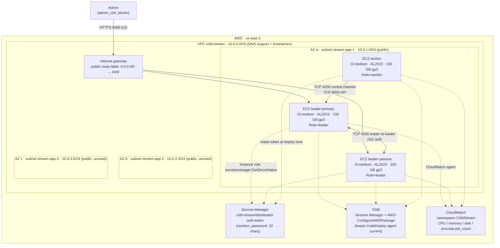
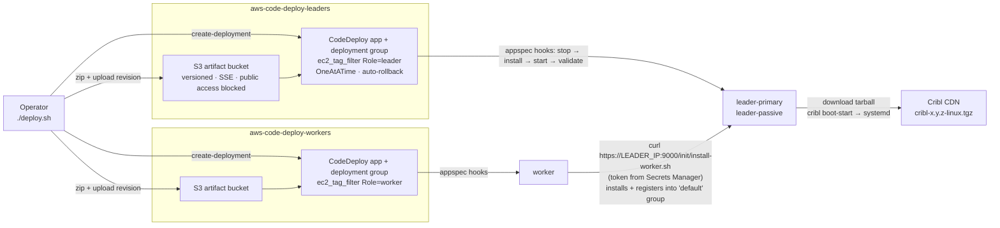
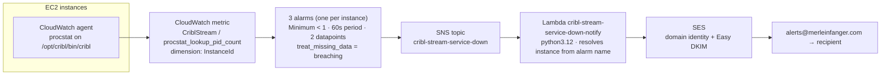

# Infrastructure diagram

Everything below lives in **us-east-2**, in a single AWS account. Three diagrams: the runtime
infrastructure, the delivery pipeline, and the alerting path.

## Runtime infrastructure

All three instances land in `public_subnet_ids[0]` — subnet 1, one AZ. The other two subnets
exist for a future spread but nothing is placed in them today (see
[Known limitations](README.md#known-limitations)).

Security groups reference each other rather than CIDRs: the Leader SG opens 9000 to
`admin_cidr_blocks` and to the Worker SG, 4200 to the Worker SG, and 4200 to itself (`self`)
for leader-to-leader. The Worker SG has no ingress at all — egress only.

## Delivery pipeline

Two structurally identical pipelines, one per role, each with its own S3 artifact bucket,
CodeDeploy application, and deployment group scoped by `ec2_tag_filter` on the `Role` tag.

The Worker never pulls from the CDN. It curls the Leader's own worker-onboarding endpoint,
which installs Cribl and registers the node in one shot — which is why the Leader IP is baked
into `deploy-workers/scripts/install.sh` today.

## Alerting path

`treat_missing_data = "breaching"` is the load-bearing setting: a powered-off or wedged host
stops publishing the metric entirely, and would otherwise sit in `INSUFFICIENT_DATA` forever
instead of alarming.
